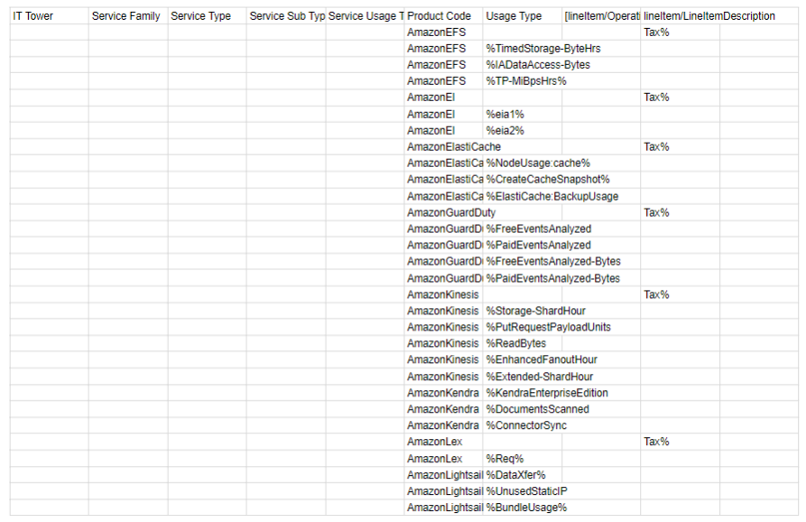

# Лабораторная работа 1 (AWS). Вариант 6

### Цель работы

Изучение облачных технологий, знакомство с уровнями абстракции облачной инфраструктуры и формирование понимания различных моделей использования сервисов.

### Задание 1 - Импортирование данных .csv в формат Excel.

Сначала импортируем данные, представленные в файле .csv в таблицу Excel. Это часть данных биллинга провайдера.

### Задание 2 - Сопоставление данных с документацией Amazon

Рассмотрим типы и подтипы сервисов, которые были предложены в таблице. Позже заполним данные столбцы сервисами. Рассмотрим предоставленные типы и подтипы.
| Тип (подтип) сервиса | Описание |
| ----- | ------------ |
| **IT Tower** | Группа, ответственная за управление инфраструктурой, отвечает за предоставление поддержки и анализ характеристик сервиса. Приведём примеры: `Machine Learning`, `Database`, `Storage`, `Cloud Apps`, `Analytics` и другие |
| **Service Family** | Это набор сервисов, предназначенных для решения определенной инфраструктурной задачи и интегрированных с определенным приложением. Приведём примеры: `In-memory Caching Service`, `Application Services` и другие |
| **Service Type** | Категория сервиса, находящаяся в рамках определенной группы сервисов. Приведём примеры: `Kinesis`, `Elastic Inference`, `Elastic File System`, `GuardDuty` и другие |
| **Service Sub Type** | Подтип сервиса с определенной функцией. Приведём примеры: `Cache Node`, `Acceleration`, `Fees` и другие |
| **Service Usage Type** |Режим работы сервиса, учитывающий его конкретный подтип, который определяет типы запросов, доступные пользователю при взаимодействии с данным сервисом. Приведём примеры: `Event Analysis`, `Tax`, `Backup Storage` и другие |
