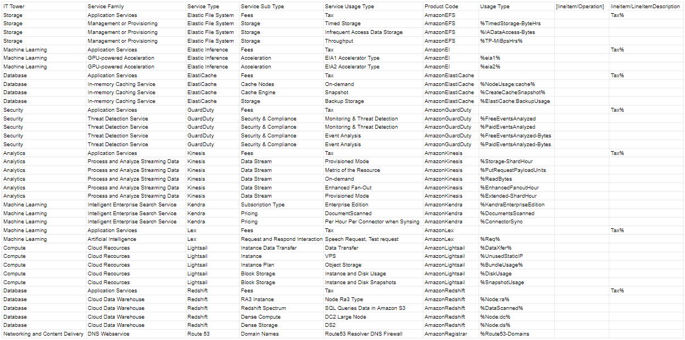

# Лабораторная работа 1 (AWS). Вариант 6

## Цель работы

Изучение облачных технологий, знакомство с уровнями абстракции облачной инфраструктуры и формирование понимания различных моделей использования сервисов.

## Задание 1 - Импортирование данных .csv в формат Excel.

Сначала импортируем данные, представленные в файле .csv в таблицу Excel. Это часть данных биллинга провайдера.

## Задание 2 - Сопоставление данных с документацией Amazon

### Описание типов и подтипов сервисов

Рассмотрим типы и подтипы сервисов, которые были предложены в таблице. Позже заполним данные столбцы самими сервисами.

| Тип (подтип) сервиса | Описание |
| ----- | ------------ |
| **IT Tower** | Группа, ответственная за управление инфраструктурой, отвечает за предоставление поддержки и анализ характеристик сервиса. Приведём примеры: `Machine Learning`, `Database`, `Storage`, `Cloud Apps`, `Analytics` и другие |
| **Service Family** | Это набор сервисов, предназначенных для решения определенной инфраструктурной задачи и интегрированных с определенным приложением. Приведём примеры: `In-memory Caching Service`, `Application Services` и другие |
| **Service Type** | Категория сервиса, находящаяся в рамках определенной группы сервисов. Приведём примеры: `Kinesis`, `Elastic Inference`, `Elastic File System`, `GuardDuty` и другие |
| **Service Sub Type** | Подтип сервиса с определенной функцией. Приведём примеры: `Cache Node`, `Acceleration`, `Fees` и другие |
| **Service Usage Type** |Режим работы сервиса, учитывающий его конкретный подтип, который определяет типы запросов, доступные пользователю при взаимодействии с данным сервисом. Приведём примеры: `Event Analysis`, `Tax`, `Backup Storage` и другие |

### Описание сервисов

Немного опишем сервисы, которые встретились до заполнения таблицы:

### 1.Amazon Elastic File System
Сервис, который обеспечивает масштабируемость, эластичность, одновременную работу с некоторыми ограничениями и шифрование файлов для использования как с облачными сервисами AWS, так и с локальными ресурсами. EFS может автоматически увеличиваться и уменьшаться по мере добавления и удаления файлов.

### 2.Amazon Elastic Inference
Сервис, который повышает производительность и экономическую эффективность рабочих нагрузок машинного обучения. Он позволяет пользователям подключать недорогие ускорители вычислений на базе графических процессоров к инстансам Amazon EC2, повышая скорость работы моделей глубокого обучения.

### 3.Amazon ElastiCache
Сервис кэширования, который повышает производительность веб-приложений за счет извлечения информации из управляемых кэшей в оперативной памяти.

### 4.Amazon GuardDuty
Сервис обнаружения угроз, который непрерывно отслеживает вредоносные действия и несанкционированное поведение для защиты учётных записей Amazon Web Services, рабочих нагрузок и данных, хранящихся в Amazon S3. Благодаря облачным технологиям сбор и объединение данных об учётных записях и сетевых действиях упрощается.

### 5.AmazonKinesis
Этот сервис представляет собой платформу для сбора, обработки и анализа потоковых данных в режиме реального времени. Он выполняет различные задачи, включая хранение данных, передачу данных, чтение данных и и.д. Это позволяет эффективно обрабатывать и анализировать информацию в потоковом режиме.

### 6.AmazonKendra
Этот сервис специализируется на применении алгоритмов искусственного интеллекта для поиска информации. Он обеспечивает точный и эффективный поиск различных типов данных внутри организации, используя машинное обучение и нейронные сети.

### 7.AmazonLex
Сервис для создания чат-ботов с поддержкой голосового и текстового взаимодействия, включая распознавание речи и естественного языка.

### 8.AmazonLighsail
Этот сервис представляет собой удобное решение для виртуального хостинга и вычислительных ресурсов, предназначенный для развертывания различных типов приложений.

### 9.AmazonRedshift
Облачное хранилище данных для аналитической обработки больших объемов данных, предоставляющее возможности хранения и анализа данных.

### 10.AmazonRegistrar
Этот сервис обеспечивает возможность эффективного управления трафиком для доменных имен, направляя его к приложениям и внутренним ресурсам. Предоставляя удобные и надежные инструменты для регистрации и управления доменами, он обеспечивает высокий уровень управляемости и надежности в этом процессе.

## Результаты

В данной таблице предоставлены результаты проделанной работы:

## Выводы

оепоа
