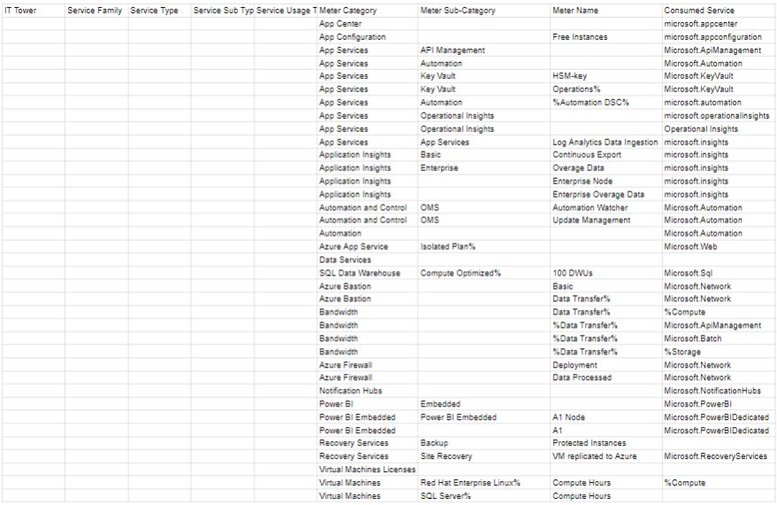
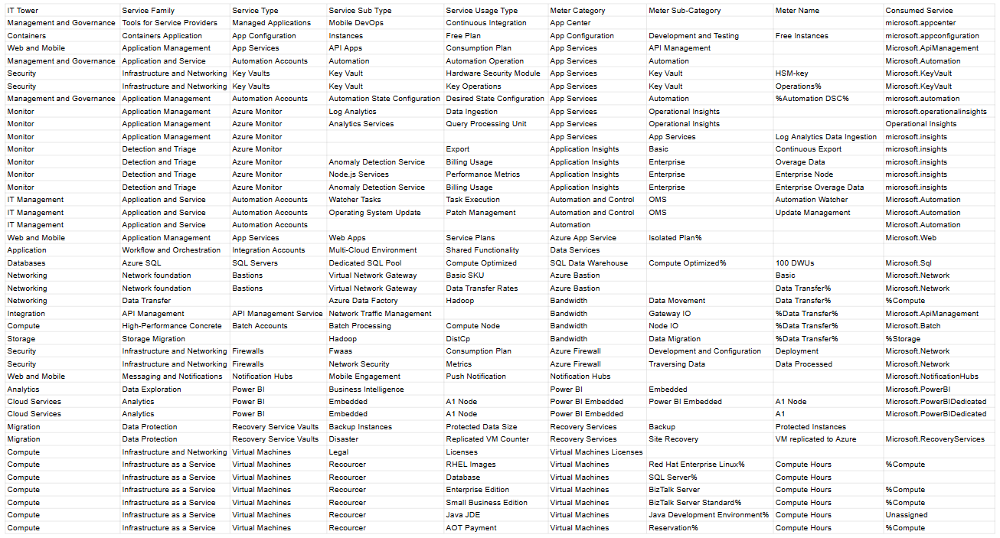

# Лабораторная работа 2 (Azure). Вариант 6

## Цель работы

Изучение облачных технологий, знакомство с уровнями абстракции облачной инфраструктуры и формирование понимания различных моделей использования сервисов. Теперь всё это нужно сделать в среде Microsoft Azure.

## Задание 1 - Импортирование данных .csv в формат Excel.

Сначала импортируем данные, представленные в файле .csv в таблицу Excel. Это часть данных биллинга провайдера.

## Задание 2 - Сопоставление данных с документацией Amazon

### Описание типов и подтипов сервисов

Рассмотрим типы и подтипы сервисов, которые были предложены в таблице. Позже заполним данные столбцы самими сервисами.

| Тип (подтип) сервиса | Описание |
| ----- | ------------ |
| **IT Tower** | Группа, ответственная за управление инфраструктурой, отвечает за предоставление поддержки и анализ характеристик сервиса. |
| **Service Family** | Это набор сервисов, предназначенных для решения определенной инфраструктурной задачи и интегрированных с определенным приложением. |
| **Service Type** | Категория сервиса, находящаяся в рамках определенной группы сервисов. |
| **Service Sub Type** | Подтип сервиса с определенной функцией. |
| **Service Usage Type** |Режим работы сервиса, учитывающий его конкретный подтип, который определяет типы запросов, доступные пользователю при взаимодействии с данным сервисом. |

### Описание сервисов

Немного опишем сервисы, которые встретились до заполнения таблицы:

### 1.Azure App Center
Сервис, который позволяет автоматизировать и управлять жизненным циклом приложений для iOS, Android, Windows и macOS. С его помощью можно автоматизировать сборки, тестировать на реальных устройствах в облаке, распространять приложения среди бета-тестеров и отслеживать реальное использование с помощью данных о сбоях и аналитике.

### 2.Azure App Configuration
Сервис, который обеспечивает простой и безопасный способ хранения конфигурации приложения на глобальном уровне в облаке, а к значениям конфигурации можно безопасно обращаться из любого количества приложений из любого региона.

### 3.Azure App Service
Полностью управляемый сервис веб-хостинга для создания веб-приложений, сервисов и RESTful API. Используя этот сервис, можно быстро создавать приложения с помощью уникального облачного сервиса для простого создания корпоративных веб-приложений и мобильных приложений для всех платформ, устройств и их развёртывания в масштабируемой и надёжной облачной инфраструктуре.

### 4.Azure Application Insights
Сервис, который помогает отслеживать производительность работающих веб-приложений. Azure Application Insights сообщает о различных исключениях, связанных с серверами и браузерами. Он предоставляет информацию о количестве запросов, отказов и времени отклика.

### 5.AmazonKinesis
Сервис для обработки и анализа потоковых данных в реальном времени в больших масштабах. Он предлагает разработчикам возможность создавать приложения, которые могут одновременно получать и обрабатывать данные из нескольких источников. Kinesis поддерживает несколько вариантов использования, включая аналитику в реальном времени, сбор данных журналов и событий, а также обработку данных, генерируемых устройствами Интернета вещей, в реальном времени.

### 6.AmazonKendra
Сервис, созданный на основе OpenSearch, который использует машинное обучение для предоставления точных и эффективных возможностей поиска по различным источникам данных. 

### 7.AmazonLex
Сервис, который используется для создания диалоговых интерфейсов в любом приложении с использованием голоса и текста. Amazon Lex предоставляет расширенные функции глубокого обучения для автоматического распознавания речи с целью преобразования речи в текст и понимания естественного языка для распознавания смысла текста.

### 8.AmazonLighsail
Сервис, который является хорошим вариантом для виртуального хостинга и вычислительных ресурсов, предназначенным для развертывания различных приложений.

### 9.AmazonRedshift
Сервис для хранилищ данных. Redshift отличается своей способностью обрабатывать аналитические рабочие нагрузки на большие данные, хранящиеся по принципу ориентированной на столбцы СУБД. Он позволяет хранить до 16 петабайт данных в кластере.

### 10.AmazonRegistrar
Данный сервис предлагает качественные решения для управления трафиком, связанного с доменными именами, направляя его к различным приложениям и внутренним ресурсам. С помощью удобных и надежных инструментов для регистрации и администрирования доменов, пользователи получают возможность значительно повысить уровень контроля и надежности в управлении своим доменным пространством.

## Результаты

В данной таблице предоставлены результаты проделанной работы:

## Выводы

По итогам выполнения лабораторной работы, были изучены 12 видов сервисов, найдены их типы, расположенные по иерархии над ними. В результате было сформировано понимание о различных вариантах использования этих сервисов. Однако, несмотря на всё это, изучение документации Microsoft Azure оказалось более сложным, из-за чего и времени потраченного на выполнение данной работы потребовалось больше. Но в целом, цели лабораторной - достигнуты.

